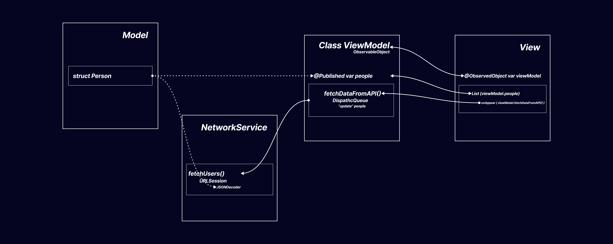

## Simple example about @ObservableObject, @StateObject/@ObservedObject

### With Combine and without

Comments and some explanations
in the code.

There are two ContentView:

- simple `ContentView`
- `EContentView` using better MVVM approach

Separated the two solutions.

- simple approach in ContentView.swift (never do this way!)
- a better approach showing the folder structure

